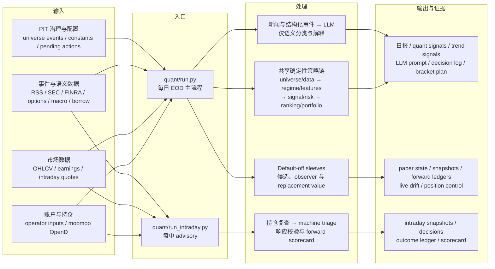
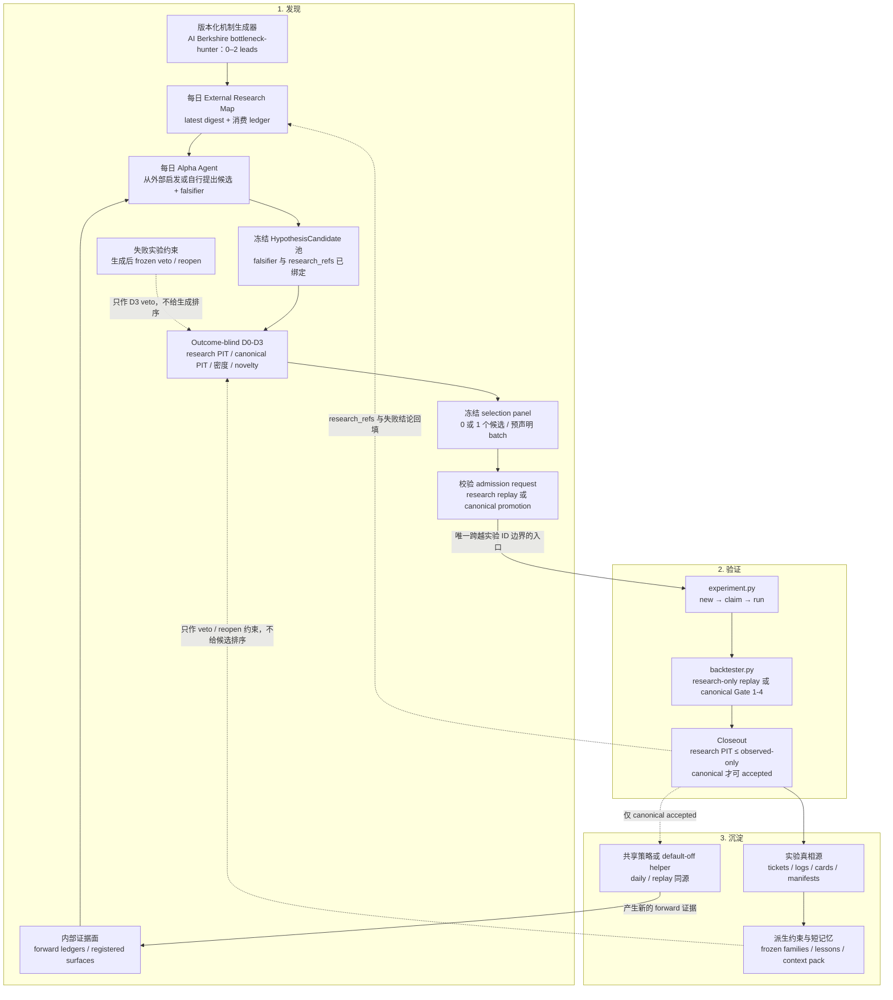

# Ginger 量化辅助交易系统

Ginger 是一个每日运行一次的中短线交易辅助系统。它用共享的量化规则生成买卖、加仓、减仓和风控信息，再把新闻与持仓上下文整理成可审计的 LLM 提示词。

核心原则：

- 代码负责硬规则：信号、仓位、止损、目标位、组合热度、候选排序。
- LLM 负责语义判断：新闻理解、事件分级、灾难 veto、模糊风险解释。
- 生产和回测必须尽量同源；不能把只在回测里赚钱的逻辑当成生产 alpha。
- 新 ticker 先通过 point-in-time universe governance 和 pilot sleeve 验证，不能直接污染 core universe。

## 文档优先级

README 是使用入口。策略实验、回测口径、生产/回测一致性和 LLM 边界以这些文档为准：

- `AGENTS.md`
- `docs/alpha-optimization-playbook.md`
- `docs/backtesting.md`
- `docs/production_backtest_parity.md`
- `docs/universe_promotion_protocol.md`
- `docs/universe_governance_rollout_plan.md`

如果 README 和代码或上述文档冲突，以代码和规范文档为准。

## 术语速查

先记住：仓库里有两套不同阶段的“门”。`D0-D3` 是**立项前、禁止读取收益结果**的
discovery preflight；`Gate 1-4` 是实验 ID 建立后，使用固定回测结果做的正式验证。
前者通过只代表“值得测、测法合法”，不代表策略赚钱。

```text
版本化机制生成器（含 AI Berkshire bottleneck-hunter）
         → 每日 external research digest + 生成后失败实验 veto
         → Alpha Agent 生成完整候选池
         → D0-D3（outcome-blind，不占实验 ID）
         → hash-bound promotion → reserve / claim 实验 ID
         → Gate 1-4（正式 before/after 验证）
         → default-off paper / forward evidence
         → Gate 5（仅判断 live eligibility）

Gate 4-P 是旁路：判断小权重加入组合是否有增量价值，不替代 Gate 4。
```

### D0-D3：立项前检查

| 名称 | 核心问题 | 典型检查 |
| --- | --- | --- |
| `D0`：数据与 PIT | 数据能用于研究，还是已经能用于晋级？ | evidence surface 已登记；`research_pit` 检查历史决策时钟、无已知泄漏和候选触达；`canonical_pit` 另查 as-known vintage、effective mapping、revision 与 parity。 |
| `D1`：预期差 | 市场原有预期和我们的新增证据是否可区分？ | observable market prior 完整；independent evidence 不与 prior 循环；所有时钟可回放。 |
| `D2`：机制与执行 | 假设是否完整、可证伪、能落到交易对象？ | hypothesis、falsifier、baseline、treatment、horizon、replacement comparator、affected tickers、transmission 和 execution envelope 完整。 |
| `D3`：研究治理 | 这是不是一个合规且真正新的候选？ | 没有 outcome contamination；queue 和 mechanism fingerprint 完整；不与既有/frozen family 重复，未借 saturated source 换字段重试。 |

每一门返回 `pass`、`park` 或 `reject`：`park` 通常表示数据、触达或独立结算行尚未成熟；
`reject` 表示合同错误、未来泄漏、重复/冻结等硬问题。代码口径见
[`quant/alpha_search_engine.py`](quant/alpha_search_engine.py)，架构说明见
[`docs/alpha_search_architecture.md`](docs/alpha_search_architecture.md)。

### Gate 1-5 与 Gate 4-P：实验验证

| 名称 | 仓库里的含义 |
| --- | --- |
| `Gate 1`：Baseline | 读取可复现的当前冠军基线；before 和 after 必须使用同一冻结输入与口径。 |
| `Gate 2`：字段合同 | 验证运行时依赖字段真实存在。最低哨兵是 `entry_date` 和 `target_price`；缺失意味着管道断了，不是可选字段没填。 |
| `Gate 3`：Survival | 检查 `signals_generated`、`signals_survived` 和 `survival_rate`。低于 5% 时禁止继续叠过滤器。 |
| `Gate 4`：Champion replacement | 在三个固定、互不重叠窗口做 before/after；综合 EV、PnL、回撤、交易数、survival、窗口稳定性、集中度和 SPY/QQQ 对照决定接受或拒绝。`pytest` 不能替代它。 |
| `Gate 4-P`：Portfolio contribution | 独立的组合贡献门：比较 `90% core + 10% candidate` 与 `100% core`，回答“小权重、资金守恒地加入后是否改善组合”。通过不等于可以替换冠军或上线真钱。 |
| `Gate 5`：Live eligibility | 只判断 canonical 候选是否具备上线资格；当前 full-stack candidate-pool 合同还要求完整 selection panel、可计算且 `DSR >= 0.95`、forward/parity/执行包络等。`research_pit` 永远不会被 Gate 5 升级。 |

`recent_observe` 只是近期诊断窗口，不参与 Gate 1-4 的接受、拒绝或回滚。正式口径见
[`docs/backtesting.md`](docs/backtesting.md)，Gate 4-P 见
[`docs/portfolio_covariance_lane.md`](docs/portfolio_covariance_lane.md)。

### 数据、证据和实验状态

| 术语 | 简明解释 |
| --- | --- |
| `research_pit` | 有授权的历史数据和可用决策时间戳，严格按 as-of 回放且明确无已知未来泄漏，但尚未证明每个历史值的 as-known vintage；可搜索、做 D0-D3 和私有回放，正向也只算 lead。 |
| `canonical_pit` | 能还原每个决策时点真实可得值：immutable/as-published vintage 或 append-only 观察、effective mapping、revision 语义和 replay/daily parity 完整；accepted/paper/live 的必要条件。 |
| `not_pit` | 决策时钟未知，或已知使用未来修订、幸存者成分、当前映射/标签倒灌等 oracle 输入；结果不能作为 alpha 证据。 |
| `as_of` / decision clock | 这条证据在什么时点已知。入场、映射、价格和结果窗口都以这个时钟对齐。 |
| `outcome-blind` | 选候选、定阈值和做 D0-D3 时不能读取候选未来收益、PnL、MFE/MAE 等结果字段。 |
| `surface` / 证据面 | 一组同来源、同生成器、可归因的候选行或 forward 行，例如 price、flow、options、event、positioning。 |
| `ledger` | 追加式机器账本；保存当时的决策、版本、时钟、候选和后续结果，供审计与回放。 |
| `forward row` | 策略冻结后，在真实时间向前产生的观察行，不是回头重建的历史样本。 |
| `settled` / `closed` | 预设结果窗口已经走完，可计算收益和 replacement value；未结算行不能冒充独立证据。 |
| `replacement value` | 候选相对当时真正会持有的替代项——现金、SPY、QQQ、core 候选或被挤出的持仓——多赚/少赚多少。 |
| `counterfactual` | 当时冻结的“如果不这样做/改选另一个会怎样”对照；必须在看到结果前定义。 |
| `baseline` / `treatment` | `baseline` 是现行策略或对照，`treatment` 是只包含本次固定决策假设的方案。 |
| `champion` / `challenger` | 当前已接受基线与本轮挑战者。Gate 4 默认是冠军替换赛。 |
| `lead` | 只有快照或回顾性线索；可以保留公式继续收集数据，不能称为 accepted alpha。 |
| `observer` | 已有 PIT forward 采集，但结果窗口或行数尚未成熟；不得影响交易。 |
| `observed_only` | 已有足够已结算 forward 行可做归因，但还不是完整 canonical Gate 1-4 候选。 |
| `gate_candidate` | 已有 `canonical_pit` 覆盖，具备进入可接受/default-off/live 的正式 Gate 1-4 资格。 |
| `H1` / `H5` / `H10` / `H20` | 结果观察 horizon；通常表示决策后 1 小时或入场后 5/10/20 个交易日。它们不是 `D0-D3` discovery gates。 |

### 策略、治理与生产边界

| 术语 | 简明解释 |
| --- | --- |
| `core` | 当前正式主策略和主 universe。 |
| `candidate pool` | 某时点所有合格候选的集合；生成候选与给现有候选打分是不同决策面。 |
| `sleeve` | 与 core 分开归因、设有独立风险/资金边界的子策略。 |
| `paper sleeve` / `default-off` | 生产每天可见、可记账，但 `trade_enabled=false`，不下单也不占用 live 资金。 |
| `pilot sleeve` | 小范围真钱试点；仍与 core 分开，受 ticker、slot、资金和 kill switch 限制。 |
| `shared-paper-first` | 第一次严肃实验就使用同一个 helper 覆盖历史 replay 与 daily default-off 输出，避免只在回测里赚钱。 |
| `production/backtest parity` | 生产和回测共享同一决策 policy；adapter 可以不同，买卖、排序、仓位和风控逻辑不能各写一套。 |
| `execution envelope` | 真钱执行边界：notional、资本帽、流动性/滑点、slot 挤出、订单时点、暴露限制、kill switch 和失败处理。 |
| `novelty gate` | reserve 前的近邻防重复检查；撞到已探索 family 时默认不分配实验 ID。 |
| `new evidence axis` | 合法的新意：真正新数据源、新 gate shape、实质新增的已结算 forward 行，或未饱和源上的无前例字段。只换阈值/子类型不算。 |
| `frozen family` | 已充分探索或已被拒的机制族；满足记录的 reopen condition 前禁止近邻重试。 |
| `saturated source` | 同一 data source + gate shape 已试很多次且接受率极低；不能靠枚举新字段继续烧实验 ID。 |
| `park` / `reopen condition` | 暂停一个证据不足的方向，并写明何时才允许重开，例如新增多少独立 settled rows。 |

### 常见指标

| 指标 | 含义 |
| --- | --- |
| `expected_value_score` / EV score | 北极星：`strategy_total_return_pct * abs(sharpe_daily)`；收益决定正负，Sharpe 只放大风险调整后的幅度。 |
| `PnL` | 盈亏金额；必须结合资金占用、成本、窗口和替代项看。 |
| `sharpe_daily` | 基于日收益的风险调整表现；越高通常越稳定，但不能替代 PnL、回撤或样本量。 |
| `max_drawdown` / Max DD | 净值从峰值到后续谷底的最大跌幅。 |
| `survival_rate` | `signals_survived / signals_generated`，用于识别过滤器是否把候选几乎全杀光。 |
| `PSR` / `DSR` | Probabilistic / Deflated Sharpe Ratio；前者衡量 Sharpe 超过基准的概率，后者进一步惩罚多重试验和挑 winner。 |
| `concentration` | 收益或风险是否过度依赖单一 ticker、top-5、行业或主题；少数名字撑起结果通常不能通过。 |

## 快速开始

```powershell
cd D:\Github\ginger
pip install -r news_collector\requirements.txt
```

编辑持仓文件：

```powershell
notepad operator_inputs\open_positions.json
```

日常运行：

```powershell
.\.venv\Scripts\python.exe quant\run.py
```

如果没有使用虚拟环境，也可以用：

```powershell
python quant\run.py
```

运行后重点看：

- `data\report_YYYYMMDD.txt`：人类可读日报。
- `data\quant_signals_YYYYMMDD.json`：完整量化信号。
- `data\daily\llm\prompts\llm_prompt_YYYYMMDD.txt`：已渲染的 LLM 审计提示词；本地 Codex 不可用时可手动兜底。
- `data\daily\llm\advice\investment_advice_YYYYMMDD.json`：本地 Codex 或手动导入后的 LLM 建议包装档。
- `data\daily\llm\responses\llm_prompt_resp_YYYYMMDD.json`：回测 replay 使用的 canonical LLM 响应档。
- `data\daily\llm\decisions\llm_decision_log_YYYYMMDD.json`：LLM 决策前的代码侧上下文日志。

## 日常交易用法

日常入口没有改变，仍然跑：

```powershell
.\.venv\Scripts\python.exe quant\run.py
```

核心交易信号仍在：

```text
data\quant_signals_YYYYMMDD.json -> signals
```

AI infrastructure pilot sleeve 信号单独在：

```text
data\quant_signals_YYYYMMDD.json -> pilot_signals
```

当前真钱 pilot sleeve：

| 字段 | 当前值 |
| --- | --- |
| Sleeve | `AI_INFRA_PILOT` |
| Trade-enabled tickers | `INTC`, `LITE`, `BE` |
| 生效日期 | `2026-05-01` |
| Core promotion | 否 |
| 最大同时 pilot 持仓 | 1 |
| 归因方式 | 入场前冻结 counterfactual snapshot |

重要解释：

- `pilot_signals` 为空时，不做 pilot 新开仓。
- `pilot_signals` 不为空时，它是真钱 pilot 候选，但仍要和 core signals 分开看。
- pilot 会使用正常 signal chain，再经过 `quant\pilot_sleeve.py` 做风险缩放、slot 限制和 pre-trade counterfactual logging。
- pilot 入场会带 `pilot_sleeve`、`pilot_entry_execution_plan`、`pilot_decision_hashes` 等字段。
- pilot 平仓后，如果交易记录带有 frozen `decision_id`，日报和 `quant_signals_YYYYMMDD.json` 会在 `pilot_attribution` 汇总 direct PnL、cash-relative PnL、replacement value 和 pending counterfactual coverage。
- INTC / LITE / BE 不是 core ticker。它们只是通过 pilot sleeve 收集 forward evidence。

默认情况下，`quant\run.py` 会在 prompt 写盘后调用本地 Codex：`codex exec --ephemeral --model gpt-5.6-sol --sandbox read-only`。`--ephemeral` 避免 automation 子进程写入 Codex 会话状态库；`read-only` 仍约束模型工具层不得改仓库。只有本地 Codex 不可用、超时或返回的 JSON 缺少 `new_trade` 时，才退回手动流程：打开 `data\daily\llm\prompts\llm_prompt_YYYYMMDD.txt`，把结构化 JSON 通过 `quant\import_advice.py` 导入。

## 运行模式：快速出 prompt + 后台积累 broad universe

`quant\run.py` 默认分两阶段跑（由 `LLM_PROMPT_PRIORITY` 控制，默认开）：

1. **Pre-prompt（窄，约 60 名 trade/pilot universe）**：先把 operator 的 prompt、核心信号和本地 Codex advice 产出并写盘。若 Codex 失败，拿 `llm_prompt_YYYYMMDD.txt` 做手动兜底。
2. **Post-prompt（宽，约 1200 名 broad universe）**：prompt 写盘后，**同一进程继续运行**，把 broad universe 的数据补齐 —— SEC companyfacts / kova / earnings / reference cache 等 sidecar 扩到 broad universe 刷新。这一阶段是**纯数据积累**，不会重新跑 prompt、LLM advice 或 sleeve 评估。

这样既能尽快拿到 prompt，又不丢失全 universe 的数据积累。默认模式下 prompt 之后那段 broad 积累会让整个进程跑得更久，但**不阻塞 operator**：prompt 已经写盘，可以直接用。

broad universe 的 **OHLCV warehouse** 刷新由独立的 `refresh_warehouse_ohlcv`（exp-20260612-002）负责，它是 staleness-aware 的：只拉过期 ticker、只补缺失的日期窗口，由 `BROAD_UNIVERSE_REFRESH_DISABLED` 控制，不归 `RUN_BROAD_ACCUMULATION` 管。

环境变量开关：

| 变量 | 默认 | 作用 |
| --- | --- | --- |
| `LLM_PROMPT_PRIORITY` | `1` | 两阶段模式（pre-prompt 窄 + post-prompt 宽）。设 `0` 则全部 inline 跑，prompt 会变慢。 |
| `GINGER_LOCAL_CODEX_ENABLED` | `1` | prompt 写盘后自动调用本地 Codex；设 `0` 只保留 prompt，不自动生成 advice。 |
| `GINGER_LOCAL_CODEX_MODEL` | `gpt-5.6-sol` | 本地 Codex 使用的模型。 |
| `GINGER_LOCAL_CODEX_EPHEMERAL` | `1` | 本地 Codex 使用一次性会话，避免受限 automation 环境写 `.codex` state DB。 |
| `GINGER_LOCAL_CODEX_SANDBOX` | `read-only` | 本地 Codex 工具层 sandbox，可选 `read-only` / `workspace-write` / `danger-full-access`。日常 advice 默认保持只读。 |
| `GINGER_CODEX_EXE` | 空 | 可选：显式指定 `codex.exe` 路径；未设置时会尝试 Codex app 自带二进制和 PATH。 |
| `GINGER_LOCAL_CODEX_TIMEOUT_SECONDS` | `900` | 本地 Codex 单次 advice 调用超时时间。 |
| `RUN_BROAD_ACCUMULATION` | `1` | post-prompt 阶段把 sidecar（earnings / kova / reference cache）扩到 broad universe。设 `0` 为「纯轻量」：sidecar 只跑约 60 名（最快）。 |
| `BROAD_UNIVERSE_REFRESH_DISABLED` | `0` | 设 `1` 关闭 broad universe 的 OHLCV warehouse 刷新（`refresh_warehouse_ohlcv`）。 |
| `DISABLE_OHLCV_WAREHOUSE_ACCUMULATION` | `0` | 设 `1` 完全关闭 OHLCV warehouse 写入。 |

典型用法：

```powershell
# 默认：快速出 prompt，然后后台积累全 universe 数据
.\.venv\Scripts\python.exe quant\run.py

# 纯轻量：只跑 trade universe，最快出 prompt，不积累 broad 数据
$env:RUN_BROAD_ACCUMULATION = "0"; .\.venv\Scripts\python.exe quant\run.py
```

## 盘中风险复查（advisory）

实现、状态机、artifact 和故障降级的完整说明见 `docs\intraday_code_driven_triage.md`；人工判断与 forward 验证原则见 `docs\live_trade_triage_framework.md`。

`quant\run_intraday.py` 是**手动触发的盘中风险复查**，一般在美西 10:00 左右跑一次。它用**盘中价格**重新评估现有持仓的 exit 规则、市场 regime 和组合热度，并生成 discretionary triage 的机器 guardrail。输出均为 advisory-only，**不**生成订单，不被 `run.py`、`backtester.py` 或实验消费，也不会写 `operator_inputs\`。

实时行情优先读本机 moomoo OpenD（默认 `127.0.0.1:11111`）。代码会一次性获取持仓、杠杆 ETF 底层、行业代理和 SPY/QQQ 的 snapshot、日线与 5 分钟线，派生 VWAP、ATR%、RSI、SMA/EMA、区间位置和尾段强弱。OpenD 不可用时，退出复查报价回退到 yfinance/EOD，但机器 guardrail 不会开放 `ADD_SMALL`。

```powershell
.\.venv\Scripts\python.exe -B quant\run_intraday.py
```

参数：

| 参数 | 作用 |
| --- | --- |
| `--no-news` | 跳过盘中 RSS 新闻抓取和过滤。 |
| `--offline` | 不做任何行情网络请求（所有报价回退到上一个 EOD 收盘价），隐含 `--no-news`，用于 smoke test。 |

输出在 `data\daily\intraday\` 下，文件名带 `YYYYMMDD_HHMMET` 时间标签，便于一天多次运行并排比较：

| 文件 | 说明 |
| --- | --- |
| `data\daily\intraday\reports\intraday_report_*.txt` | 人类可读盘中复查报告。 |
| `data\daily\intraday\llm\intraday_llm_prompt_*.txt` | 盘中 LLM 提示词。 |
| `data\daily\intraday\snapshots\intraday_review_*.json` | 完整盘中快照（regime、持仓复查、热度、pending actions）。 |
| `data\daily\intraday\news\intraday_*_news_*.json` | 盘中新闻（未加 `--no-news` 时）。 |
| `data\daily\intraday\market_data\intraday_opend_context_*.json` | OpenD 原始快照、日线/5 分钟线和代码派生指标。 |
| `data\daily\intraday\decisions\intraday_decision_template_*.json` | 代码生成的安全默认动作、允许动作和 decision-row 模板。 |
| `data\daily\intraday\decisions\intraday_triage_*.json` | 新闻语义审查通过代码校验后的不可覆盖 forward decision。 |

机器 guardrail 的规则边界：

- 已触发可执行 EXIT/REDUCE 的持仓只允许 `REDUCE_RISK`；`TIME_STOP REVIEW` 一类复核规则默认 `HOLD_ONLY`，但不允许加仓。
- 非 RTH、OpenD/技术字段不完整、价格未站回 VWAP/EMA8/SMA20、底层/行业/大盘未确认时，不开放 `ADD_SMALL`。
- 接近现有止损、组合热度到上限、现金低于 5%、距离现有 target 不足 2%，或已有 pending 风险动作时，默认 `HOLD_ONLY`。
- 只有所有代码条件通过时，`ADD_SMALL` 才会进入 `allowed_actions`；机器默认动作仍为 `WAIT`，新闻审查不得越权。

新闻语义审查得到 JSON 后，必须通过校验器写最终 ledger：

```powershell
.\.venv\Scripts\python.exe -B quant\finalize_intraday_decision.py `
  --template data\daily\intraday\decisions\intraday_decision_template_<timestamp>.json `
  --response <semantic_response.json>
```

校验器会拒绝漏 ticker、重复 ticker、越过 `allowed_actions`、非法置信度，以及没有已核验新闻链接的 `ADD_SMALL`。终端会打印 `SUMMARY: breached=… approaching=… regime=… heat=… add_review_eligible=…`。

盘中调仓使用独立的 forward 回测框架，不进入标准日线回测。每次最终 decision 写入后运行：

```powershell
.\.venv\Scripts\python.exe -B quant\run_intraday_backtest.py
```

它按“决策后第一根 5 分钟线开盘成交”的固定口径，从 OpenD 更新 `h1`、当日收盘、次日收盘和第 3 个交易日收盘结果；同时比较最终动作、机器默认动作、不调仓、始终加仓及 WAIT 后确认入场。日报在 `data\daily\intraday\backtests\`，最新摘要为 `latest_scorecard.json`。`finalize_intraday_decision.py` 成功写入 ledger 后会自动运行该结算器；只有排障时才使用 `--skip-backtest`。该框架只评估 forward 决策，不是标准 Gate 1-4 回测，也不会下单。

## 标准回测

标准回测仍然用 `quant\backtester.py`。按 `docs/backtesting.md`，当前固定看三个非重叠窗口：

```powershell
.\.venv\Scripts\python.exe quant\backtester.py --start 2025-10-23 --end 2026-04-21 --ohlcv-warehouse data\experiments\exp-20260519-030\warehouse_main.sqlite --ohlcv-warehouse-snapshot-source data\ohlcv\ohlcv_snapshot_20251023_20260421.json
```

```powershell
.\.venv\Scripts\python.exe quant\backtester.py --start 2025-04-23 --end 2025-10-22 --ohlcv-warehouse data\experiments\exp-20260519-030\warehouse_main.sqlite --ohlcv-warehouse-snapshot-source data\ohlcv\ohlcv_snapshot_20250423_20251022.json
```

```powershell
.\.venv\Scripts\python.exe quant\backtester.py --start 2024-10-02 --end 2025-04-22 --ohlcv-warehouse data\experiments\exp-20260519-030\warehouse_main.sqlite --ohlcv-warehouse-snapshot-source data\ohlcv\ohlcv_snapshot_20241002_20250422.json
```

关键口径：

- 标准三窗口是 core strategy 回测。
- `INTC` / `LITE` / `BE` 的 `first_trade_allowed_as_of` 是 `2026-05-01`。
- 因为标准窗口都早于 `2026-05-01`，所以标准回测不会把 pilot ticker 塞进历史 core universe。
- 这不是漏接，而是 point-in-time 防未来泄漏。
- 想看 pilot 的历史静态研究价值，需要单独标注为 static pool experiment，不能当生产级证据。
- pilot 的生产级证据从 `2026-05-01` 之后的 forward decisions、direct PnL、replacement value、risk-adjusted replacement value 开始积累。

最新 pilot sleeve 激活时的标准三窗口结果记录在：

- `experiments\logs\exp-20260501-029.json`
- `experiments\tickets\exp-20260501-029.json`

## Pilot sleeve replay backtest

Default backtests remain core-only. To replay the AI infrastructure pilot
sleeve (`AI_INFRA_PILOT`) with point-in-time universe eligibility, add
`--include-pilot-sleeve`:

```powershell
.\.venv\Scripts\python.exe quant\backtester.py --start 2025-10-23 --end 2026-04-21 --ohlcv-warehouse data\experiments\exp-20260519-030\warehouse_main.sqlite --ohlcv-warehouse-snapshot-source data\ohlcv\ohlcv_snapshot_20251023_20260421.json --include-pilot-sleeve
```

This is called `试点子组合回测` in the docs. It preloads eligible pilot OHLCV
as of the backtest end date, but daily trading eligibility is still decided
from `data\state\universe\universe_events.jsonl` point-in-time. Historical windows before
`2026-05-01` should show `pilot_sleeve_replay.entries == 0`; that is the
expected no-leakage result.

## 持仓配置

编辑 `operator_inputs\open_positions.json`：

```json
{
  "portfolio_value_usd": 70000,
  "cash_usd": 5000,
  "positions": [
    {
      "ticker": "NVDA",
      "direction": "long",
      "shares": 41,
      "avg_cost": 102.17,
      "entry_date": "2025-11-15",
      "target_price": 145.0,
      "risk_notes": "core AI holding"
    }
  ]
}
```

字段说明：

| 字段 | 必填 | 说明 |
| --- | --- | --- |
| `portfolio_value_usd` | 是 | 账户总市值，含现金，用于热度和仓位计算。 |
| `cash_usd` | 推荐 | 现金余额，用于实时组合价值和可交易性判断。 |
| `ticker` | 是 | 股票代码，大写。 |
| `shares` | 是 | 持仓股数。 |
| `avg_cost` | 是 | 平均成本。 |
| `entry_date` | 推荐 | 建仓日期，缺失会影响 time stop。 |
| `target_price` | 推荐 | 原始信号目标价，缺失会影响 signal target exit。 |
| `override_stop_price` | 可选 | 手动止损价，适合保本止损或风险事件后收紧。 |

## 系统架构

系统从两个视角阅读：运行时视图回答“每天怎样产生信号和证据”，研究闭环回答“策略变化怎样被发现、验证并进入共享内核”。

### 运行时视图



### Alpha 发现与验证闭环



两张图的共同边界：`run.py`、盘中复查和 default-off sleeves 都不会直接向券商提交订单；可量化的硬规则归共享代码所有，LLM 不能越过风控、排序、仓位或执行边界。发现、D0-D3 和 panel 都不占实验 ID；只有通过哈希绑定的 admission request 才能调用 `experiment.py new`。`research_pit` request 只授权 private replay 且结果上限为 `observed_only`；`canonical_pit` promotion 才可能进入 shared/default-off/live。完整分级见 [`docs/research_pit_policy.md`](docs/research_pit_policy.md)。AI Berkshire 在这里是版本化的机制 lead 生成器，不是 EvidenceSurface、选股器或新策略；其 0–2 lead、来源独立性、真实扫描 freshness 和零交易权限合同见 [`docs/alpha_mechanism_generator.md`](docs/alpha_mechanism_generator.md)。mailbox 只保留为可选的本机协作工具，不参与 alpha admission。图中的虚线是研究治理反馈，不是运行时交易指令。

## 输出文件

| 文件 | 说明 |
| --- | --- |
| `data\report_YYYYMMDD.txt` | 人类可读日报。 |
| `data\quant_signals_YYYYMMDD.json` | 完整量化输出，含 core `signals` 和 pilot `pilot_signals`。 |
| `data\quant_signals_YYYYMMDD.json -> pilot_attribution` | Pilot direct PnL、replacement value 和 counterfactual coverage。 |
| `data\trend_signals_YYYYMMDD.json` | 持仓状态和 exit 信号。 |
| `data\daily\llm\prompts\llm_prompt_YYYYMMDD.txt` | LLM 输入提示词。 |
| `data\daily\llm\advice\investment_advice_YYYYMMDD.json` | 本地 Codex 或手动导入后的 LLM 建议包装档。 |
| `data\daily\llm\responses\llm_prompt_resp_YYYYMMDD.json` | 回测 replay 使用的 canonical LLM 响应档。 |
| `data\daily\llm\decisions\llm_decision_log_YYYYMMDD.json` | LLM 决策前的代码侧上下文日志。 |
| `data\news_YYYYMMDD.json` | 原始新闻。 |
| `data\clean_trade_news_YYYYMMDD.json` | 交易相关过滤后新闻。 |
| `data\universe_state_YYYYMMDD.json` | 当日 universe governance 状态。 |

## 实验记录

策略修改和失败尝试必须落盘：

- `docs\experiment_log.jsonl`：结构化实验主日志。
- `experiments\logs\`：单个实验详细记录。
- `experiments\tickets\`：实验 ticket。
- `docs\experiment_log_format.md`：字段说明。

原则：

- 成功实验要记录。
- 失败实验更要记录。
- 记录必须包含参数、窗口、改前/改后指标、生产影响和失败原因。
- 涉及生产/回测一致性的改动必须声明 `production_impact`。

## 开发和测试

常规测试：

```powershell
python -m pytest quant\test_quant.py -v
```

Pilot sleeve 相关测试：

```powershell
python -m pytest quant\test_pilot_sleeve.py quant\test_universe_manager.py quant\test_universe_adapter.py quant\test_sources.py
```

提交前至少确认：

- 改动是否只改变一个独立因果变量。
- 是否跑了对应测试或说明为什么没跑。
- 策略逻辑是否同时被生产和回测共享，或已写入 `docs\production_backtest_parity.md` 作为允许差异。
- 如果是 alpha 实验，是否按三窗口记录结果。
